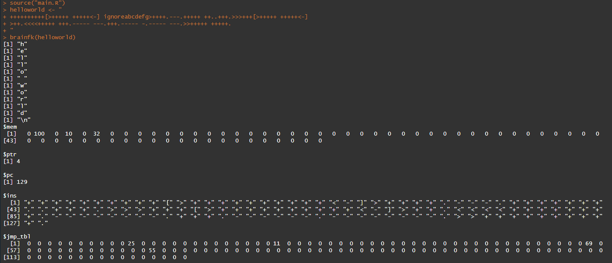

# brainfk_rrepl
REPL for brainfk written in R

## Usage

To interpret brainfk code:

```R
source("main.R")
code <- "your brainfk code goes here"
brainfk(code)
```

To enter REPL:

```R
source("main.R")
repl()
```

  